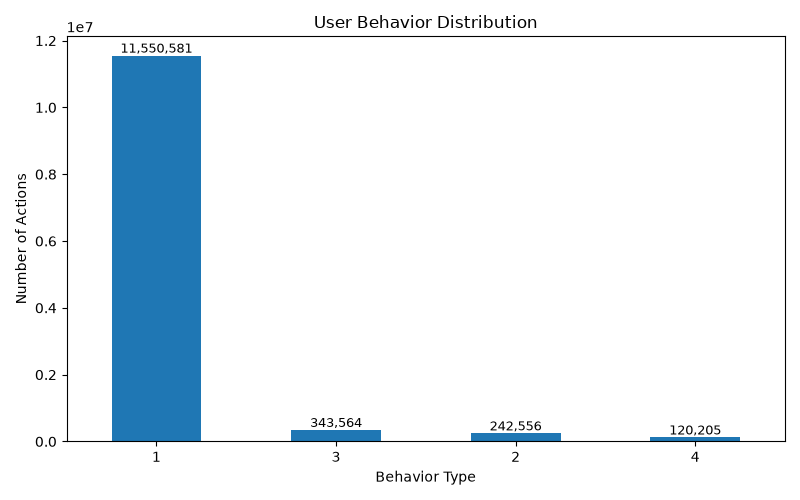
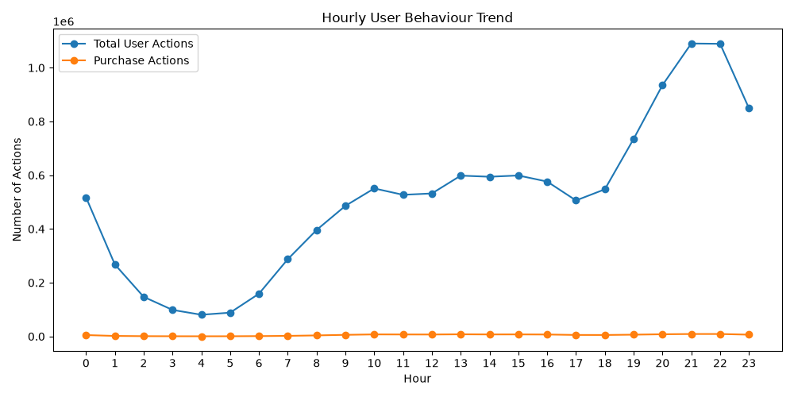
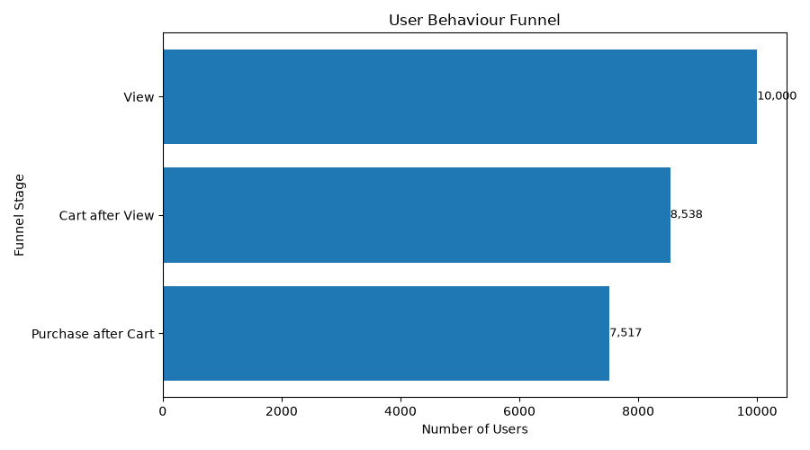
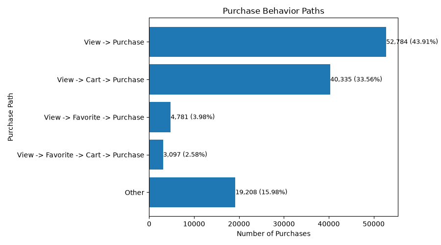
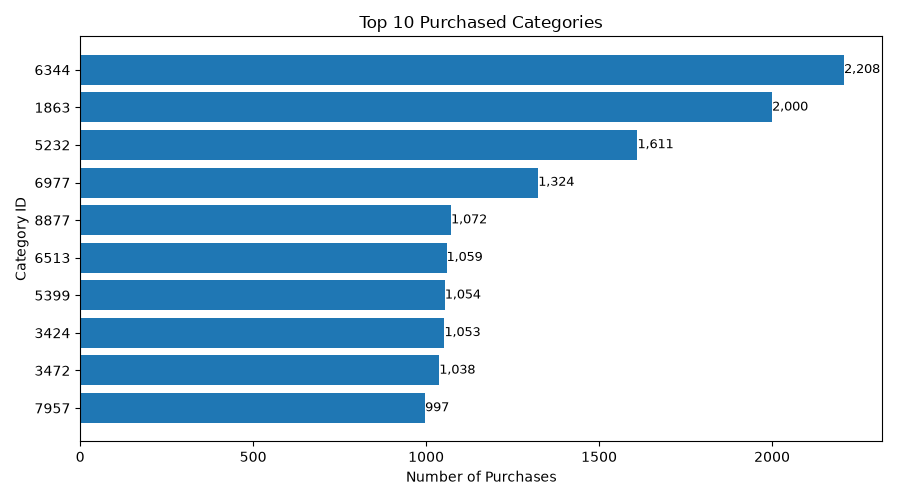
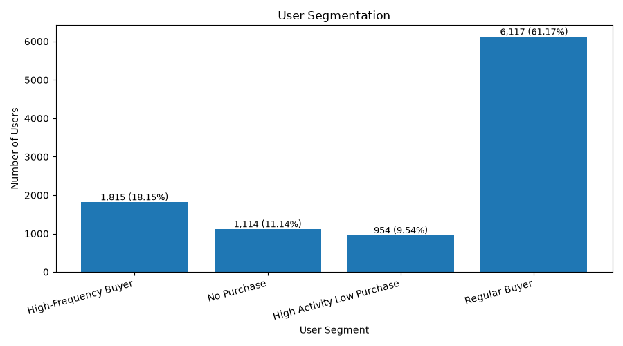

# Final SQL Analysis Report: Taobao User Behaviour

## 1. Introduction

This report presents the final results of the PostgreSQL analysis layer for the
Taobao User Behaviour Analysis project. The database was implemented using
PostgreSQL 17 and contains a normalized set of user, item, category, behaviour
type, and event tables. SQL was used to reproduce the principal analyses from
the existing Python and pandas workflow: behaviour distribution, hourly
activity, product and category rankings, chronological conversion, purchase
paths, and percentile-based user segmentation.

The SQL results were checked against the previously verified Python results.
Duplicate source rows were retained because the data-quality stage detected but
did not automatically remove them. Consequently, all event-level results in
this report use the same analytical population as the existing project.

## 2. Dataset Statistics

The database contains 12.26 million event records describing interactions
between 10,000 users and approximately 2.88 million items.

| Dataset measure | Result |
| --- | ---: |
| Behaviour event records | 12,256,906 |
| Unique users | 10,000 |
| Unique items | 2,876,947 |
| Unique categories | 8,916 |
| Average recorded actions per user | 1,225.69 |

Each event contains a timestamp, user identifier, item identifier, category
relationship, and behaviour code. The behaviour mapping is:

| Code | Behaviour |
| ---: | --- |
| 1 | View |
| 2 | Favorite |
| 3 | Cart |
| 4 | Purchase |

The large difference between the number of items and the number of users shows
that the dataset represents a broad product catalogue. However, the data does
not contain prices, item names, category names, or demographic attributes.
These omissions constrain the analysis to behavioural frequency and conversion
rather than revenue, product semantics, or demographic profiling.

## 3. Behaviour Analysis Findings

### 3.1 Behaviour distribution

| Behaviour | Number of actions | Share of all actions |
| --- | ---: | ---: |
| View | 11,550,581 | 94.24% |
| Favorite | 242,556 | 1.98% |
| Cart | 343,564 | 2.80% |
| Purchase | 120,205 | 0.98% |
| **Total** | **12,256,906** | **100.00%** |

Views account for 94.24% of recorded activity, demonstrating that platform use
is concentrated strongly at the product-discovery stage. Cart actions occur
more frequently than favorite actions, with 343,564 cart events compared with
242,556 favorite events. This suggests that the cart is a more common recorded
indicator of purchase intent than the favorite function.

Purchases represent 120,205 events, or 0.98% of all actions. This percentage is
an event-level share and must not be interpreted as the proportion of users who
purchased. A user may generate many views before purchasing, and the user-level
conversion results are therefore substantially higher than the event-level
purchase share.

### 3.2 Hourly activity

The hourly query returns all 24 hours, including hours with no activity. The
observed pattern is strongly time-dependent: activity falls during the early
morning, reaches its lowest level at approximately 04:00, and then increases
through the day. The highest activity occurs at approximately 21:00–22:00.
Purchase activity follows the broader activity pattern, although its much
smaller scale reflects the 0.98% purchase share.

For an operational system, this pattern would support scheduling engagement
campaigns, recommendation refreshes, and high-availability capacity around the
evening activity peak. The result should nevertheless be interpreted in the
context of the dataset's collection period rather than assumed to represent all
Taobao traffic.

## 4. Purchase Funnel Findings

### 4.1 Chronological conversion funnel

The funnel applies explicit chronological conditions. A cart is counted only
if it occurs after a user's first view, and a purchase is counted only if it
occurs after a valid cart event.

| Funnel measure | Result |
| --- | ---: |
| Users with a View | 10,000 |
| Users with a Cart after View | 8,538 |
| Users with a Purchase after Cart | 7,517 |
| View-to-Cart conversion | 85.38% |
| Cart-to-Purchase conversion | 88.04% |
| Overall chronological conversion | 75.17% |

The View-to-Cart stage loses 1,462 users, while the Cart-to-Purchase stage loses
1,021 users. The first stage therefore represents the larger measured loss in
the funnel. The result indicates that improving product relevance, product-page
information, and the transition from browsing to intent may provide a larger
opportunity than changes limited to checkout-stage users.

The overall conversion rate of 75.17% is based on this project's user-level,
chronological definition. It should not be compared directly with the 0.98%
event-level purchase share or with a session-based e-commerce funnel.

### 4.2 Purchase behaviour paths

Each purchase event was classified using the chronological history of its
user-item pair. Repeated behaviours were retained, and more specific paths were
given priority over simpler paths.

| Purchase path | Purchases | Percentage |
| --- | ---: | ---: |
| View -> Purchase | 52,784 | 43.91% |
| View -> Cart -> Purchase | 40,335 | 33.56% |
| View -> Favorite -> Purchase | 4,781 | 3.98% |
| View -> Favorite -> Cart -> Purchase | 3,097 | 2.58% |
| Other | 19,208 | 15.98% |
| **Total** | **120,205** | **100.01%*** |

\*The displayed percentages sum to 100.01% because each path percentage is
rounded independently to two decimal places. The underlying purchase counts
cover exactly 120,205 purchase events.

The direct View-to-Purchase path is the largest individual path, accounting for
52,784 purchases (43.91%). View-to-Cart-to-Purchase contributes a further
40,335 purchases (33.56%). Together, these two paths account for 93,119
purchases, or 77.47% of all purchase events.

Favorite-based paths account for 7,878 purchases, approximately 6.55% of the
total. The `Other` group remains material at 19,208 purchases (15.98%), showing
that a non-trivial share of purchases follows sequences outside the four named
paths. A future extension could decompose this residual group into additional
ordered patterns.

## 5. Product and Category Analysis Findings

The product analysis ranks item identifiers and category identifiers by the
number of Purchase events. Because the source data contains identifiers rather
than descriptive names, the rankings identify concentration but do not explain
the commercial characteristics of the leading products.

### 5.1 Top purchased categories

| Rank | Category ID | Purchases |
| ---: | ---: | ---: |
| 1 | 6344 | 2,208 |
| 2 | 1863 | 2,000 |
| 3 | 5232 | 1,611 |
| 4 | 6977 | 1,324 |
| 5 | 8877 | 1,072 |
| 6 | 6513 | 1,059 |
| 7 | 5399 | 1,054 |
| 8 | 3424 | 1,053 |
| 9 | 3472 | 1,038 |
| 10 | 7957 | 997 |

Category `6344` ranks first with 2,208 purchases, followed by category `1863`
with 2,000 purchases. The leading category represents approximately 1.84% of
all purchase events, while the two leading categories together represent 3.50%.
The ten categories contain 13,416 purchases, or 11.16% of all purchase events.

These figures indicate that purchases are not dominated by a very small number
of categories. The remaining 8,906 categories collectively account for the
large majority of purchases. Category descriptions would be required before
the ranking could be translated into product-specific recommendations.

### 5.2 Item-level interpretation

The SQL item query produces a deterministic Top 10 ranking based on purchase
count, using `item_id` as the secondary ordering field when counts are tied.
Item names and product attributes are not available, so item identifiers alone
are insufficient for meaningful qualitative interpretation in the final
report. The item ranking is therefore best treated as a reproducible technical
output that could later be enriched using a product metadata table.

## 6. User Analysis Findings

The user-level SQL query calculates total actions, counts for each behaviour,
and active days for every user. Segmentation then applies an 80th-percentile
activity threshold across all users and an 80th-percentile purchase-frequency
threshold across users with at least one purchase.

| User segment | Users | Percentage |
| --- | ---: | ---: |
| High-Frequency Buyer | 1,815 | 18.15% |
| Regular Buyer | 6,117 | 61.17% |
| High Activity Low Purchase | 954 | 9.54% |
| No Purchase | 1,114 | 11.14% |
| **Total** | **10,000** | **100.00%** |

Regular Buyers form the largest segment, containing 6,117 users (61.17%). This
group represents the main opportunity for increasing repeat purchase frequency
through relevant recommendations and retention activity. High-Frequency Buyers
account for 1,815 users (18.15%) and represent the strongest group for loyalty
and high-value retention strategies.

The High Activity Low Purchase group contains 954 users (9.54%). These users
are engaged but purchase less frequently than the high-purchase threshold,
making them suitable for interventions focused on conversion friction,
product relevance, and purchase reminders. A further 1,114 users (11.14%) have
no purchase event and may require first-purchase incentives, trust-building, or
improved onboarding.

In total, 8,886 users (88.86%) have at least one purchase event, while all
10,000 users are assigned to exactly one mutually exclusive segment. This count
validation confirms that the segmentation logic has complete user coverage.

## 7. Validity and Limitations

Several limitations affect the interpretation of these results:

- Duplicate records were retained to preserve consistency with the established
  Python analysis. Further source validation is required before any deletion.
- The absence of price and quantity fields prevents revenue, average order
  value, and customer monetary-value analysis.
- Item and category names are unavailable, limiting interpretation of product
  rankings to numeric identifiers.
- The dataset contains no demographic or campaign attributes, so segment
  differences cannot be explained using user characteristics or marketing
  exposure.
- Funnel analysis is performed at user level with project-specific
  chronological rules, while path analysis is performed for each purchase
  within a user-item history. These results answer different analytical
  questions and should not be combined as if they used the same denominator.
- The `Other` purchase-path category combines multiple unmodelled sequences and
  would benefit from further decomposition.

## 8. Conclusion

The SQL database layer successfully reproduces the project's principal
behavioural analyses over 12,256,906 events. The results show a platform heavily
oriented toward product viewing, with the strongest activity during the evening
and a high user-level chronological conversion rate. Direct purchase and
cart-assisted purchase paths together explain more than three quarters of all
purchase events. Purchases are distributed across a broad category set rather
than being dominated by the ten leading categories.

User segmentation identifies a large Regular Buyer population, a meaningful
High-Frequency Buyer group, and two clear conversion opportunities among highly
active low-purchase users and users with no purchase. Together, these results
provide a reproducible SQL foundation for the final project discussion and for
the Power BI dashboard currently under development, while the stated data
limitations define the scope of valid conclusions.
