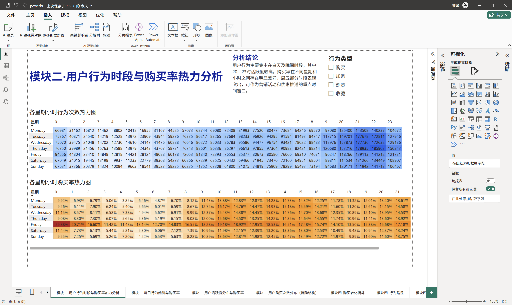
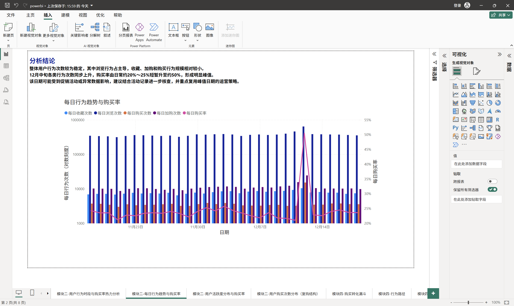
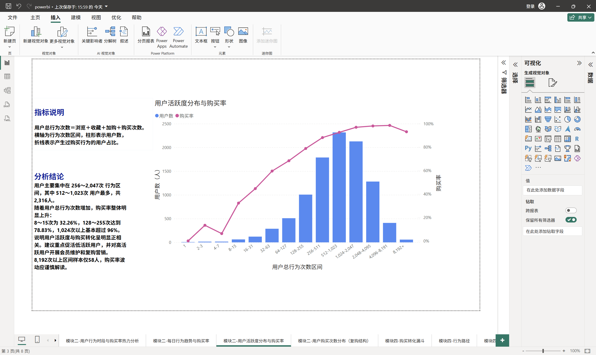
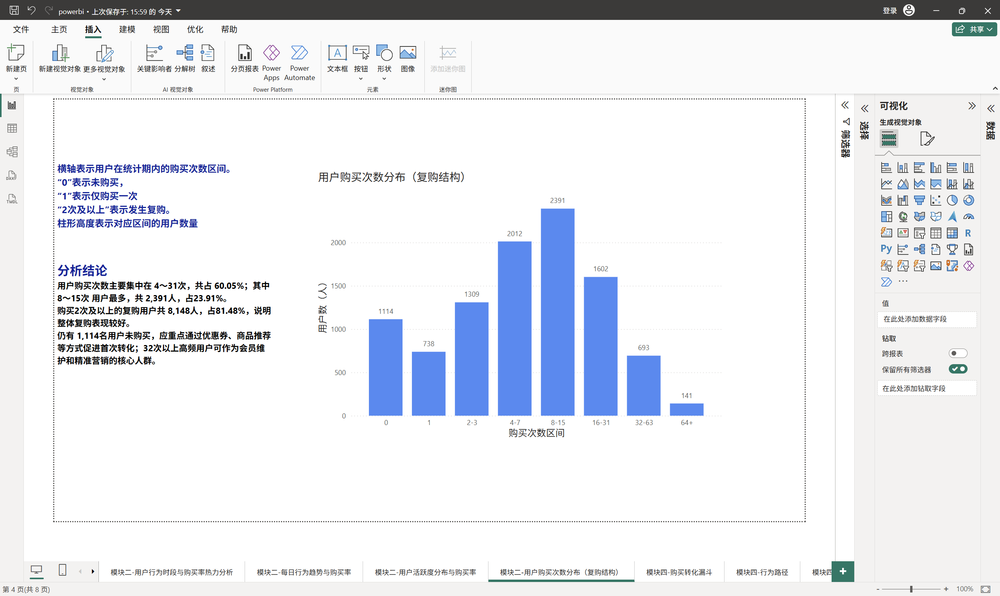
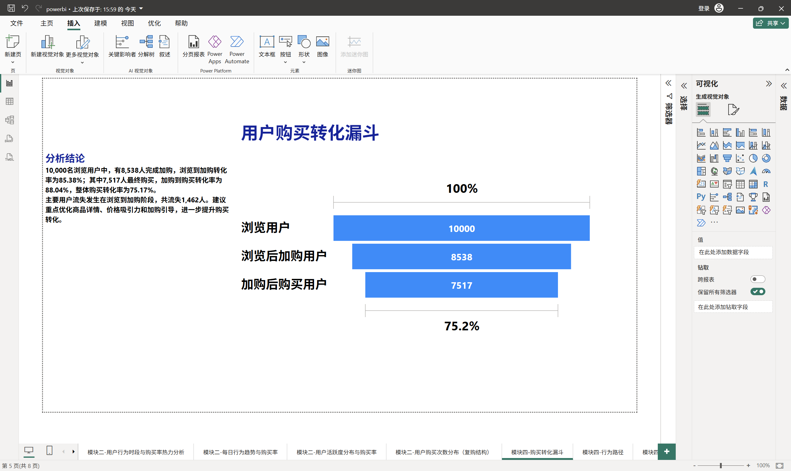
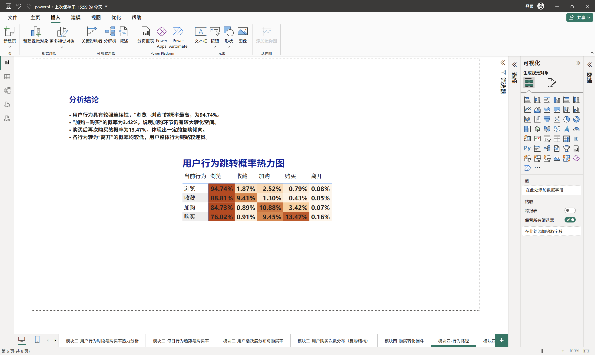
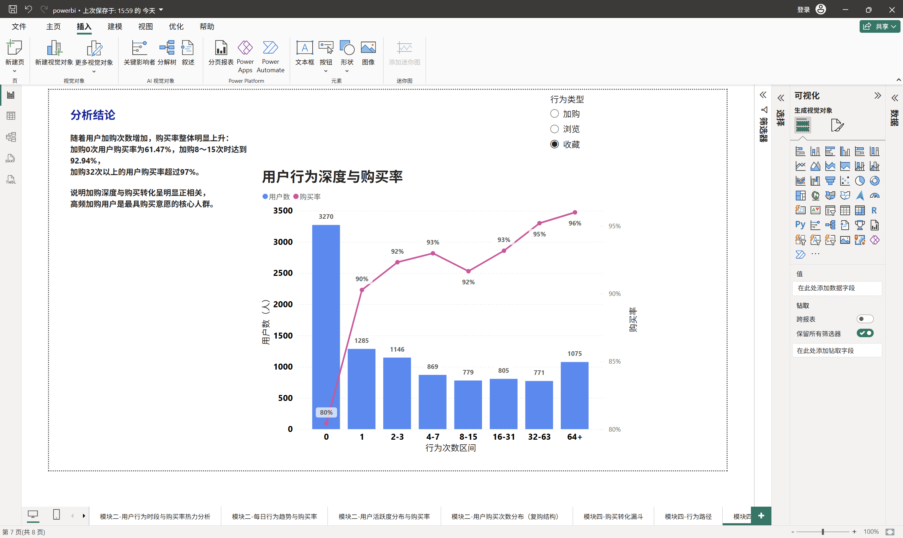
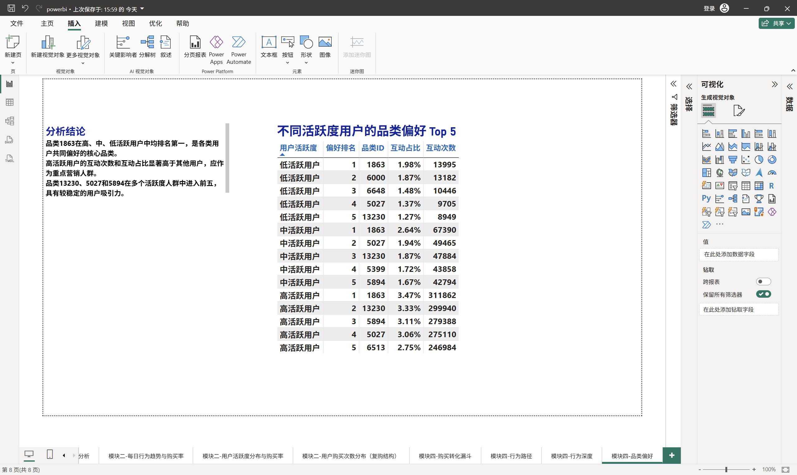

# 淘宝用户行为分析项目报告

## 摘要

这次分析使用 12,256,906 条淘宝用户行为记录，重点观察浏览、收藏、加购和购买之间的关系。处理流程分为三部分：Python 负责数据检查和基础分析，PostgreSQL 负责保存全量明细并复算指标，Power BI 负责展示结果。

从结果看，浏览占全部行为的 94.24%，用户主要在 20—22 时活跃。按时间顺序计算，“浏览 → 加购 → 购买”的整体转化率为 75.17%，流失最多的是浏览到加购阶段。购买路径主要有两条：“浏览后直接购买”和“浏览 → 加购 → 购买”，合计占 77.47%。用户复购也比较明显，8,148 名用户购买过两次及以上。

## 一、数据和分析目标

原始文件为 `data/user_behavior_processed.csv`，约 492 MB，记录时间为 2025 年 11 月 18 日至 12 月 18 日。

| 数据指标 | 数量 |
| --- | ---: |
| 行为记录 | 12,256,906 |
| 用户 | 10,000 |
| 商品 | 2,876,947 |
| 商品类别 | 8,916 |

数据只有 5 个字段：

| 字段 | 含义 |
| --- | --- |
| `time` | 行为发生时间 |
| `user_id` | 用户编号 |
| `item_id` | 商品编号 |
| `item_category` | 商品类别编号 |
| `behavior_type` | 行为类型：1 浏览、2 收藏、3 加购、4 购买 |

这份报告主要回答四个问题：

1. 用户最常做什么，通常在什么时间活跃？
2. 用户从浏览到购买，主要在哪个阶段流失？
3. 活跃度、加购深度和购买之间有什么关系？
4. 哪些用户和类别值得重点关注？

数据中没有价格、购买数量、商品名称、用户属性、活动标签和会话编号，所以这里只分析行为频次和转化关系，不计算销售额，也不做用户画像或活动归因。

## 二、代码实现和分析方法

### 1. Python 分析流程

Python 入口是 `src/main.py`，它按顺序调用以下函数：

| 代码位置 | 主要函数 | 作用 |
| --- | --- | --- |
| `data_processing.py` | `load_data()`、`prepare_datetime()`、`check_data_quality()` | 读取数据、转换时间、检查缺失值和重复行 |
| `analysis.py` | `display_dataset_summary()` | 输出数据规模和用户、商品、类别数量 |
| `analysis.py` | `analyze_purchased_items()`、`analyze_purchased_categories()` | 统计购买商品和类别排行 |
| `analysis.py` | `calculate_behavior_distribution()` | 统计四类行为次数 |
| `analysis.py` | `calculate_chronological_funnel()` | 计算严格时序漏斗 |
| `analysis.py` | `calculate_hourly_trend()` | 统计 0—23 时的行为量和购买量 |
| `purchase_paths.py` | `analyze_purchase_behavior_paths()` | 按用户—商品时间线识别购买路径 |
| `user_segmentation.py` | `analyze_user_segmentation()` | 汇总用户指标并完成互斥分群 |
| `visualization.py` | 各类 `plot_*()` 函数 | 输出静态分析图 |

漏斗不是简单判断用户有没有做过三种行为。代码先找首次浏览，再找浏览之后的首次加购，最后找有效加购之后的首次购买。这样可以排除“先购买、后加购”这类顺序不成立的记录。

购买路径使用“用户—商品”粒度。每次购买都会检查此前是否发生过浏览、收藏和加购；同一用户对同一商品买了多次，也会按多次购买统计。

用户分群以总行为数衡量活跃度，以购买次数衡量购买强度。两个阈值都使用连续型第 80 百分位，并按固定优先级打标签，保证每名用户只属于一个群体。

`tests/` 中的轻量测试覆盖数据读取、时间转换、质量检查、行为统计、购买路径和用户分群，不需要加载完整 CSV。

### 2. PostgreSQL 和 Power BI

PostgreSQL 中的表统一放在 `taobao` schema。导入时先写入暂存表，再检查行为编码和商品—类别关系；如果目标表已有数据，脚本会拒绝再次全量导入，避免重复写入。

SQL 按 Python 的口径重新计算行为分布、漏斗、路径、排行和用户分群。仓库中的验证结果表明，两边结果一致。

Power BI 不直接加载千万级明细，而是读取 SQL 生成的 12 个聚合数据集。目前已完成 8 个页面，包括时间热力图、每日趋势、用户活跃度、复购结构、购买漏斗、行为路径、行为深度和品类偏好。

看板主要使用矩阵热力图、柱线组合图、漏斗图和切片器展示结果。Power BI 负责交互和呈现，核心指标仍沿用 Python 与 SQL 已核对的计算口径，避免在不同工具中重复定义指标。报告中的 Power BI 截图对应当前 8 个页面，可以直接看到最终展示效果。

## 三、主要分析结果

### 1. 用户行为以浏览为主

| 行为类型 | 行为次数 | 占比 |
| --- | ---: | ---: |
| 浏览 | 11,550,581 | 94.24% |
| 收藏 | 242,556 | 1.98% |
| 加购 | 343,564 | 2.80% |
| 购买 | 120,205 | 0.98% |

浏览占比达到 94.24%，说明大部分操作发生在商品发现和比较阶段。加购次数高于收藏次数，在这批数据中，加购是更常见的购买意向行为。

购买行为占 0.98%，但这个比例的分母是全部行为记录，不是用户数，不能直接当作用户购买率。

### 2. 用户主要在晚间活跃

21 时和 22 时的行为量最高，分别为 1,090,178 次和 1,088,961 次；4 时最低，仅 80,487 次。22 时的购买次数为 8,845 次，也处于全天高位。

星期—小时热力图中，星期四 22 时的浏览、收藏和加购次数达到各自峰值。推荐和优惠提醒可以优先考虑晚间，但还要结合购买率和具体日期，不能只看行为总量。

星期五 0 时的同时间格购买率达到 29.88%。2025 年 12 月 12 日正好是星期五，当天各类行为也明显上升。由于数据没有活动标签，这里只能判断存在异常峰值，不能直接认定是某次促销造成的。

### 3. 浏览到加购是漏斗的主要流失点

| 漏斗阶段 | 用户数 | 相对上一阶段转化率 | 相对浏览转化率 |
| --- | ---: | ---: | ---: |
| 浏览 | 10,000 | 100.00% | 100.00% |
| 浏览后加购 | 8,538 | 85.38% | 85.38% |
| 加购后购买 | 7,517 | 88.04% | 75.17% |

浏览到加购流失 1,462 人，加购到购买流失 1,021 人。整体时序转化率为 75.17%，更大的改进空间在浏览到加购阶段。

需要注意，漏斗按用户总体行为计算，不要求三个阶段发生在同一商品上；购买路径使用用户—商品粒度，两者不能直接对比。

### 4. 两条路径贡献了 77.47% 的购买

| 购买路径 | 购买次数 | 占比 |
| --- | ---: | ---: |
| 浏览 → 购买 | 52,784 | 43.91% |
| 浏览 → 加购 → 购买 | 40,335 | 33.56% |
| 浏览 → 收藏 → 购买 | 4,781 | 3.98% |
| 浏览 → 收藏 → 加购 → 购买 | 3,097 | 2.58% |
| 其他路径 | 19,208 | 15.98% |

“浏览后直接购买”和“浏览 → 加购 → 购买”是最常见的两条路径，合计占 77.47%。收藏相关路径合计只有 6.56%，收藏更像辅助决策行为，不是多数用户购买前的必经步骤。

其他路径占 15.98%，可能与观察期截断、跨设备行为或缺少会话边界有关，不能直接视为异常。

### 5. 复购用户占比较高

10,000 名用户中，8,886 人至少购买过一次，1,114 人没有购买。购买两次及以上的用户有 8,148 人，占全部用户的 81.48%，占购买用户的 91.69%。

购买 4—31 次的用户共有 6,005 人，占全部用户的 60.05%，是最主要的复购群体。这部分用户更适合会员权益、复购提醒和相关品类推荐。

### 6. 活跃度和加购深度与购买倾向正相关

用户主要集中在 512—1,023 次和 1,024—2,047 次两个行为区间，共 4,443 人。两个区间的购买率分别为 92.62% 和 96.94%。当行为次数达到 2,048—8,191 次时，购买率接近 98%。

以加购为例，未加购用户的购买率为 61.47%，加购 1 次后升至 80.63%，加购 8—15 次时为 92.94%，加购 64 次及以上时达到 98.57%。加购次数可以作为识别高意向用户的重要信号。

这里的购买率表示同一分组中至少购买过一次的用户占比，不要求购买发生在某次加购之后。因此，它反映的是相关关系，不能单独证明加购直接导致购买。

### 7. 用户分群给出了更明确的运营对象

| 用户群体 | 用户数 | 占比 |
| --- | ---: | ---: |
| 高频购买用户 | 1,815 | 18.15% |
| 普通购买用户 | 6,117 | 61.17% |
| 高活跃低购买用户 | 954 | 9.54% |
| 未购买用户 | 1,114 | 11.14% |

高频购买用户适合重点维护；普通购买用户是向高频用户转化的主要来源；高活跃低购买用户已经表现出较高兴趣，但购买不足，适合使用降价提醒、优惠券或相似商品推荐；未购买用户更适合低门槛首购激励。

### 8. 行为转移以连续浏览为主

浏览之后仍然浏览的概率为 94.74%，从浏览直接转向购买的下一步概率为 0.79%，从加购转向购买为 3.42%。这说明用户通常会连续比较多个商品，再进入加购或购买阶段。

矩阵中的“离开”只是用户在观察期内的最后一条记录，不是会话退出。原始数据没有 `session_id`，所以这里不能用于计算页面跳出率。

### 9. 品类偏好既有共性，也有差异

购买次数排名前三的类别是 6344、1863 和 5232，分别有 2,208、2,000 和 1,611 次购买。前十类别合计占全部购买的 11.16%，购买并没有高度集中在少数类别。

类别 1863 在低、中、高活跃用户中都排在互动次数第一，互动占比从低活跃用户的 1.98% 上升到高活跃用户的 3.47%。类别 13230、5027 和 5894 也多次进入不同活跃层级的前五名，可以作为跨人群推荐的候选类别。

这里的品类偏好按全部互动次数统计，不等于购买排行或销售额。由于数据只有类别编号，报告不对具体商品内容作推测。

## 四、Power BI 可视化分析

Power BI 使用 `powerbi/data/` 中的 12 个聚合数据集，不直接加载 1,225 万条明细。各数据集的统计粒度不同，因此在模型中保持独立，不自动建立关系。刷新时运行 `powerbi/refresh_exports.ps1`，由 PostgreSQL 重新生成并校验 CSV，Power BI 只负责交互展示。

### 1. 星期与小时热力分析

该页面用两个矩阵分别展示行为次数和购买率，并通过切片器切换浏览、收藏、加购和购买。购买率按同一“星期—小时”单元格中的购买用户数除以浏览用户数计算，是同期购买倾向，不是时序漏斗转化率。

行为量主要集中在白天和晚间，20—23 时整体较高；星期四 22 时是多个行为类型的高峰。星期五 0 时购买率达到 29.88%，明显高于其他时间段。运营触达可以优先放在晚间，但星期五 0 时需要结合具体日期和活动记录单独核查。

### 2. 每日行为趋势与购买率

组合图同时展示每日浏览、收藏、加购、购买次数和购买率。大部分日期的行为量较稳定，购买率通常在 20%—25%之间；12 月中旬各类行为同步上升，购买率短时接近 50%，形成明显峰值。

这个页面适合用来发现异常日期，但当前数据没有活动标签，无法判断峰值来自促销、自然增长还是数据异常。更稳妥的做法是先标记该日期，再结合运营日志和源数据复核。

### 3. 用户活跃度分布与购买率

柱形表示各行为次数区间的用户数，折线表示区间内至少购买过一次的用户占比。用户主要集中在 256—2,047 次区间，其中 512—1,023 次人数最多。随着总行为次数增加，购买率总体上升，说明活跃度可以作为购买倾向的参考信号。

8,192 次以上区间只有 58 人，虽然购买率仍然较高，但样本量太小，不宜据此制定大范围策略。实际运营应优先关注人数较多、购买率仍有提升空间的中高活跃用户。

### 4. 用户购买次数与复购结构

购买次数主要集中在 4—31 次，合计 6,005 人，占全部用户的 60.05%；其中 8—15 次区间人数最多，为 2,391 人。共有 8,148 名用户购买过两次及以上，说明复购是这批用户的重要特征。

未购买和仅购买一次的用户更适合首购、二购激励；4—31 次的主体用户适合会员权益和复购提醒；32 次以上的高频用户人数较少，更适合重点维护和精细化运营。

### 5. 用户购买转化漏斗

漏斗按照“先浏览、后加购、再购买”的时间顺序计算。10,000 名浏览用户中，8,538 人后续加购，7,517 人最终购买；浏览到加购转化率为 85.38%，加购到购买转化率为 88.04%，整体转化率为 75.17%。

浏览到加购阶段流失 1,462 人，是当前最大的流失点。相比单纯催促结算，更应优先检查商品详情、价格吸引力、推荐匹配和加购引导。

### 6. 用户行为跳转概率

行为转移矩阵展示用户当前行为之后紧接着发生的下一种行为。浏览后继续浏览的概率为 94.74%，说明连续比较商品是最常见的行为；加购后直接购买的概率为 3.42%，仍有较大提升空间；购买后再次购买的概率为 13.47%，体现出一定复购倾向。

矩阵中的“离开”表示用户在观察期内的最后一条记录，不等于退出页面或结束会话。由于源数据没有会话编号，这个指标不能当作页面跳出率。

### 7. 用户行为深度与购买率

该页面通过切片器切换浏览、收藏和加购次数区间，并同时观察用户规模与购买率。以加购为例，未加购用户购买率为 61.47%，加购 8—15 次时达到 92.94%，64 次及以上达到 98.57%，说明加购深度与购买倾向明显正相关。

当前截图选择的是“收藏”，图表同样显示收藏次数增加时购买率总体上升。但页面左侧结论仍按“加购”口径书写，说明固定文本没有随切片器更新。正式发布前应使用动态标题和动态结论，或者锁定切片器，避免误读。

### 8. 不同活跃度用户的品类偏好

页面分别列出低、中、高活跃用户互动次数最多的五个类别。类别 1863 在三个活跃层级中都排名第一，属于跨人群的共同偏好；类别 13230、5027 和 5894 也多次进入前五，具有较稳定的用户吸引力。

高活跃用户的互动次数和互动占比明显更高，可以作为重点营销人群。不过当前只有类别编号，没有类别名称、价格和销售额，因此这部分结果更适合用于推荐候选，暂时不能直接判断商业价值。

## 五、结论与建议

从整体结果看，用户以浏览和商品比较为主，晚间最活跃；加购是较强的购买意向信号，也是连接浏览和购买的关键环节。购买用户中复购人群占比较高，后续运营不应只关注首购，还要重视留存和持续购买。

建议重点关注以下方向：

1. 将推荐、优惠提醒等触达优先安排在 20—22 时，并把活动日和普通日期分开观察。
2. 优先优化浏览到加购阶段，重点检查商品信息、价格展示、推荐匹配和加购激励。
3. 对 954 名高活跃低购买用户单独运营，降低他们从兴趣到购买的决策门槛。
4. 维护购买 4—31 次的主体复购人群，通过会员权益、复购提醒和关联推荐提升留存。
5. 持续观察类别 1863，后续结合类别名称、价格和订单金额再判断实际商业价值。

## 六、局限和后续方向

当前数据缺少价格、数量、订单金额、商品名称、会话编号和活动标签，因此还不能分析销售额、客单价、页面跳出或活动效果。重复记录目前保留，也需要在取得更完整的数据生成规则后再判断是否去重。

下一步可优先补充商品名称、类别名称、价格、订单金额和活动标签，再扩展 RFM 用户价值分层、活动前后对比、商品关联和收入贡献分析。Power BI 后续需要补充刷新日期和发布状态，统一页面主题，并把会随切片器变化的固定结论改成动态文本。

## 七、项目成果

目前已经完成：

- Python 数据处理、分析和可视化代码；
- PostgreSQL 数据库、导入流程和分析 SQL；
- Python 与 SQL 核心结果核对；
- 12 个 Power BI 聚合数据集；
- 模块二和模块四共 8 个 Power BI 页面；
- 8 个 Power BI 页面截图及对应分析说明；
- 核心逻辑测试、静态图表和说明文档。

整个项目已经形成从原始数据、分析代码、数据库复算到 Power BI 展示的完整链路。后续调整指标或扩展看板时，可以直接定位到对应代码和数据来源。
